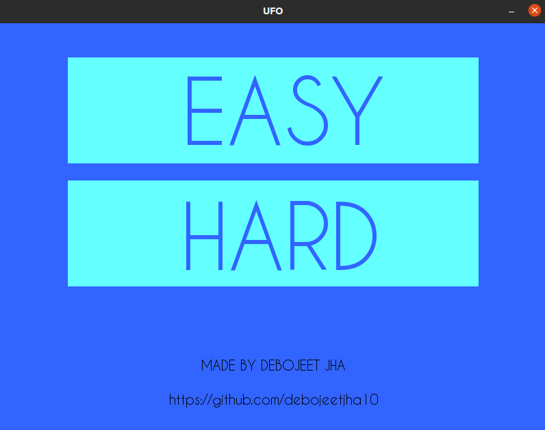
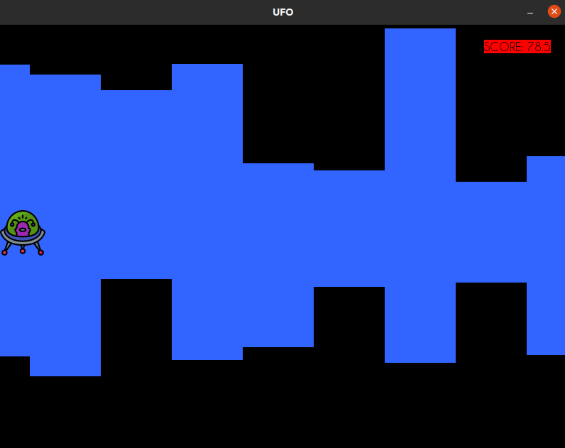
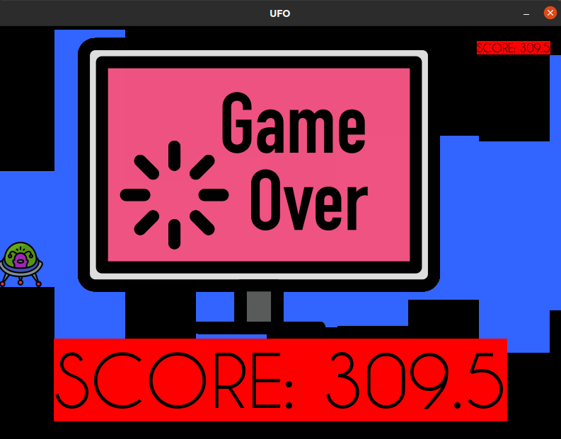

## README.MD
___

___
## UFO_JUMP

There is a space shuttle.you are the astronaut,make sure the ship skips all the obstacles:::

You can use all the arrow keys to control the ship.

***PRO TIP:*** The space bar makes it easy to lift the ship up._/*don’t tell anyone*/_

Gravity is pulling you down hurry up!!!!.
___

## HOW To Play

 for LINUX and UNIX follow the commands to run it. 
 <h2>OPEN TERMINAL</h2>
 
  1.Enter the command `pip3 install pygame` *you will not need this if you have pygame pre-installed.*
     
  2.If the previous command throws an error, give the command `sudo apt-get install python3-pip` then follow the step 1.or enter the command `sudo apt-get install python3-pygame`
  
  *after installing pygame in your system.*
     
  3.Enter the command `git clone https://github.com/debojeetjha10/UFO_JUMP.git`
     
  4.Enter the command `cd UFO_JUMP`
     
  5.Enter the command  `python3 screen.py`

  6. Tell me your score:)<a href = "mailto:debojeetjha@gmail.com" target = "_blank">email me</a>

___
## START SCREEN

 ___
 ## GAME SCREEN
 
  ___
 ## GAMEOVER SCREEN
 
 

